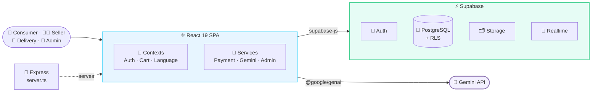

<!-- ═══════════════════════════ HEADER ═══════════════════════════ -->
<div align="center">


<a href="https://karumartbdtest.netlify.app">
  
</a>

<br/>

<a href="https://karumartbdtest.netlify.app"></a>
<a href="docs/report/Karumart_Project_Report.pdf"></a>
<a href="#-getting-started"></a>

<br/><br/>


</div>


<div align="center">
  
  <br/>
  <sub><i>🏠 The live Karumart storefront with the AI support chat</i></sub>
</div>


## 🧭 Navigation

<div align="center">

| 📖 [About](#-about) | ✨ [Features](#-key-features) | 👥 [Roles](#-user-roles) | 📸 [Screenshots](#-screenshots) | 🧰 [Tech Stack](#-tech-stack) |
|:---:|:---:|:---:|:---:|:---:|
| 🏗️ [**Architecture**](#️-architecture) | 🚀 [**Setup**](#-getting-started) | 🗄️ [**Database**](#️-database) | 🧪 [**Testing**](#-testing) | 🗺️ [**Roadmap**](#️-roadmap) |

</div>


## 📖 About

<table>
<tr>
<td width="60%">

Bangladesh's villages are full of skilled hands — **jamdani** & **nokshi katha** weavers, potters, bamboo & cane makers, jute crafters, **sitol pati** artisans. But most of them can't sell online: mainstream e-commerce isn't built for them, and Facebook selling has no cart, no tracking, and no trust.

**Karumart** fixes that. 🧺

- 🧑 Sellers list products through a **simple guided dashboard**
- 🛡️ An admin **approves every seller & product** before it goes public
- 🛒 Buyers enjoy a familiar **cart → checkout → delivery → review** flow
- 🌐 Everything works in **বাংলা and English**

</td>
<td width="40%" align="center">

### 🎓 Academic Project

**CSE412 — Software Engineering**<br/>
East West University<br/>


**Group 16 · Team Pi** 🥧

<br/>

🤝 Built with a **real external client**

</td>
</tr>
</table>


## ✨ Key Features

<table>
<tr>
<td width="50%" valign="top">

### 🛍️ Smart Shopping
> 🌐 Bilingual UI — instant বাংলা ⇄ English switch<br/>
> 🔍 Search in **English, Bengali & Banglish**<br/>
> &nbsp;&nbsp;&nbsp;&nbsp;`saree` · `sari` · `shari` → **শাড়ি** ✓<br/>
> 📍 Filter by category & district<br/>
> 🛒 Persistent cart & ❤️ wishlist<br/>
> ⚡ Flash sales with live countdown<br/>
> 🎟️ Voucher codes (% / fixed, min-spend, expiry)

</td>
<td width="50%" valign="top">

### 📦 Orders & Delivery
> 🔄 Full order lifecycle with returns<br/>
> 📍 Live tracking for buyer, rider & admin<br/>
> 🧾 Downloadable **PDF invoices**<br/>
> 🏷️ Printable **delivery slips**<br/>
> ⭐ Ratings & reviews<br/>
> 📮 Complaints, refunds & replacements<br/>
> 🗺️ District-aware delivery assignment

</td>
</tr>
<tr>
<td width="50%" valign="top">

### 🛡️ Trust & Moderation
> ✅ **Admin approval** for sellers & products<br/>
> 🧊 Instant **shop freeze** for violations<br/>
> 🏅 Badges: Best Seller · Official · Karu Mall<br/>
> 📜 Full **audit log** of admin actions<br/>
> 🔐 **Row Level Security** on every table<br/>
> 🏷️ Auto-generated unique SKUs

</td>
<td width="50%" valign="top">

### 🤖 AI + 📊 Analytics
> ✍️ One-click **Bengali product descriptions**<br/>
> 💬 **AI support chatbot** grounded in live catalog<br/>
> 📈 Monthly revenue & order charts<br/>
> 🍩 Order-status & category breakdowns<br/>
> 📉 Daily sales trend<br/>
> 🏆 Top-5 best-selling products

</td>
</tr>
</table>

<div align="center">

### 🔄 Order Journey

`🛒 Pending` ➜ `✅ Confirmed` ➜ `📦 Picked Up` ➜ `🚚 On the Way` ➜ `🎉 Delivered` ➜ `⭐ Review`

</div>


## 👥 User Roles

<div align="center">

| | Role | Highlights |
|:---:|:---|:---|
| 🛒 | **Consumer** | Browse · Search · Buy · Track · Review · Return |
| 🧑 | **Seller** <sub>(`Seller` in code)</sub> | Add products with AI descriptions · Manage stock · Fulfil orders · Open/close shop |
| 🛵 | **Delivery Man** | District-filtered orders · One-tap status updates · Printable slips |
| 👑 | **Admin** | 13-tab control panel · Approvals · Freeze · Vouchers · Banners · Badges · Analytics · Audit logs |

</div>


## 📸 Screenshots

<div align="center"><sub>✨ Every screenshot is captured from the live deployment ✨</sub></div>
<br/>

<details open>
<summary><h3>🛒 Consumer Journey</h3></summary>

<table>
<tr>
<td align="center"><b>🔍 Search</b><br/><sub>English query → Bengali catalog</sub><br/></td>
<td align="center"><b>🛒 Cart</b><br/><sub>Live totals & quantity stepper</sub><br/></td>
</tr>
<tr>
<td align="center"><b>❤️ Wishlist</b><br/><sub>Synced with cart state</sub><br/></td>
<td align="center"><b>👤 Dashboard</b><br/><sub>Orders, coupons & summary</sub><br/></td>
</tr>
<tr>
<td align="center"><b>📍 Order Tracking</b><br/><sub>5-step live status</sub><br/></td>
<td align="center"><b>💡 Recommendations</b><br/><sub>Recommended for you</sub><br/></td>
</tr>
</table>

</details>

<details>
<summary><h3>👑 Admin Control Panel</h3></summary>

<table>
<tr>
<td align="center"><b>🧑 Seller Management</b><br/></td>
<td align="center"><b>📦 All Orders</b><br/></td>
</tr>
<tr>
<td align="center"><b>🎟️ Vouchers</b><br/></td>
<td align="center"><b>⚡ Flash Sale</b><br/></td>
</tr>
<tr>
<td align="center"><b>✅ Product Moderation</b><br/></td>
<td align="center"><b>📜 Audit Log</b><br/></td>
</tr>
<tr>
<td align="center"><b>🖼️ Slider Banners</b><br/></td>
<td align="center"><b>⚙️ Site Settings</b><br/></td>
</tr>
<tr>
<td align="center"><b>📊 Analytics</b><br/></td>
<td align="center"><b>👥 Admin Accounts</b><br/></td>
</tr>
</table>

<div align="center">
➕ More: <a href="docs/screenshots/admin/08-side-promo-banners.png">Side Promo Banners</a> ·
<a href="docs/screenshots/admin/09-bottom-static-banners.png">Bottom Static Banners</a> ·
<a href="docs/screenshots/admin/13-admin-panel-v2.png">Admin Panel V2</a>
</div>

</details>

<details>
<summary><h3>📱 Responsive Design</h3></summary>

<div align="center">
<table>
<tr>
<td align="center"><b>💻 Laptop</b><br/></td>
<td align="center"><b>📱 Mobile</b><br/></td>
</tr>
</table>
</div>

</details>

<details>
<summary><h3>📐 Original Wireframes</h3></summary>

<table>
<tr>
<td align="center"><b>🧑‍🌾 Seller Dashboard</b><br/></td>
<td align="center"><b>👑 Admin Dashboard</b><br/></td>
<td align="center"><b>🏪 Shop Storefront</b><br/></td>
</tr>
</table>

</details>


## 🧰 Tech Stack

<div align="center">


<br/><br/>

| 🎨 Frontend | ⚙️ Backend | 🤖 AI | 🛠️ Tooling |
|:---:|:---:|:---:|:---:|
| React 19 | Supabase (BaaS) | Google Gemini | Vite 6 |
| TypeScript 5.8 | PostgreSQL + RLS | `@google/genai` | Express 4 |
| React Router 7 | Supabase Auth (JWT) | `gemini-flash-latest` | Vitest |
| Tailwind CSS 4 | Supabase Storage | | jsPDF + html2canvas |
| shadcn/ui | Supabase Realtime | | Recharts · Sonner |

</div>


## 🏗️ Architecture

> 💡 **No custom REST API.** The React SPA talks **directly to Supabase**. Business logic lives in React Contexts & service modules, and data access is locked down at the database with **Row Level Security**. Express only serves the build.



<details>
<summary><b>🗺️ View detailed diagrams</b></summary>
<br/>

<table>
<tr>
<td align="center"><b>🏛️ System Architecture</b><br/></td>
<td align="center"><b>🎭 Use Case Diagram</b><br/></td>
<td align="center"><b>🔗 ER Diagram</b><br/></td>
</tr>
</table>

</details>

📘 Deep dive → [`docs/ARCHITECTURE.md`](docs/ARCHITECTURE.md)

### 📁 Project Structure

```bash
karumart/
├── 🚂 server.ts                 # Express server / Vite middleware
├── 🗄️ database_setup.sql        # Supabase schema + RLS policies
├── 📂 src/
│   ├── 🧭 App.tsx               # Routes
│   ├── 🚪 main.tsx              # Entry point
│   ├── 🧠 contexts/             # Auth · Cart · Language
│   ├── 🔧 services/             # payment · gemini · admin
│   ├── 📚 lib/                  # supabase · searchUtils · translations
│   │                            # districts · pdfGenerator
│   ├── 🧩 components/           # Layout · ProductCard · modals · ui/*
│   ├── 📄 pages/
│   │   ├── Home · ProductDetail · ShopDetail · Cart · Checkout
│   │   ├── Login · Register · AdminLogin
│   │   └── Dashboard/           # Consumer · Seller · Delivery · Admin
│   └── 🏷️ types/index.ts        # Shared TS types
├── 📖 docs/                     # Report · diagrams · screenshots
└── 📦 package.json
```


## 🚀 Getting Started

<details open>
<summary><b>📋 Prerequisites</b></summary>
<br/>

| Tool | Get it |
|:---|:---|
| 🟢 Node.js 18+ & npm | [nodejs.org](https://nodejs.org/) |
| ⚡ Supabase project (free) | [supabase.com](https://supabase.com/) |
| 🤖 Gemini API key | [aistudio.google.com](https://aistudio.google.com/app/apikey) |

</details>

**1️⃣ Clone & install**

```bash
git clone https://github.com/<your-username>/karumart.git
cd karumart
npm install
```

**2️⃣ Set up the database**

> Supabase Dashboard → **SQL Editor** → paste [`database_setup.sql`](database_setup.sql) → **Run** ▶️<br/>
> Then create a public **Storage** bucket for product images 🖼️

**3️⃣ Add your keys**

```bash
cp .env.example .env
```

```env
VITE_SUPABASE_URL=https://your-project-id.supabase.co
VITE_SUPABASE_ANON_KEY=your-supabase-anon-key
VITE_GEMINI_API_KEY=your-gemini-api-key
```

> [!CAUTION]
> Never commit `.env`. It's already in `.gitignore` 🔒

**4️⃣ Launch** 🚀

```bash
npm run dev        # 🔥 dev server
npm run build      # 📦 production build → dist/
npx vitest run     # 🧪 run tests
```

**5️⃣ Become admin** 👑

> [!TIP]
> Register a normal account → Supabase **Table Editor → `profiles`** → set `role` to `admin` → log in from the admin login page. Create more admins from the dashboard.


## 🗄️ Database

<div align="center">

**10 tables** · **PostgreSQL** · **Row Level Security everywhere** 🔐

| | Table | Purpose |
|:---:|:---|:---|
| 👤 | `profiles` | Every account — role, shop info, approval, freeze, badges |
| 📦 | `products` | Catalog — `is_approved` gates public visibility |
| 🧾 | `orders` · `order_items` | Purchases, payment & delivery status, price snapshot |
| ⭐ | `reviews` | Ratings & comments |
| 🎟️ | `vouchers` | Discount codes |
| 📮 | `complaints` | Returns, refunds, quality issues |
| 🖼️ | `banners` · `static_banners` | Homepage promotions |
| 📜 | `admin_logs` | Audit trail |
| ⚙️ | `site_settings` | Delivery charge, free-delivery threshold, contacts |

</div>

📘 Full schema → [`docs/DATABASE.md`](docs/DATABASE.md)


## 🧪 Testing

<div align="center">

| 📁 Test Files | 🧪 Tests | ✅ Passed | ❌ Failed | 🎯 Pass Rate |
|:---:|:---:|:---:|:---:|:---:|
| **10** | **146** | **143** | **3** | **98.0%** |

`████████████████████████████████████████████████░` **98%**


<sub>🔍 Utilities · 🗺️ Districts · 🔤 Banglish search · 🌐 Translations · 🏷️ Types · 💳 Payments · 🧠 Auth/Cart/Language contexts</sub>

</div>

📘 Details → [`docs/TESTING.md`](docs/TESTING.md)


## ⚠️ Known Limitations

> [!WARNING]
> - 💳 **Payments are simulated** — bKash, Nagad & SSLCommerz return mock transaction IDs. Only Cash on Delivery is real.
> - 🔑 **Gemini key is client-side** (`VITE_GEMINI_API_KEY`) — should be proxied via a backend for production.
> - 🏁 **Checkout isn't atomic** — concurrent buys of a low-stock item could race.
> - 🧪 **3 unit tests failing**, and the 20-case integration plan isn't executed yet.

## 🗺️ Roadmap

- [ ] 💳 Live bKash / Nagad / SSLCommerz
- [ ] 🔐 Backend-proxied Gemini calls
- [ ] ⚛️ Atomic checkout via Supabase DB function
- [ ] 🧪 Fix failing tests + run integration plan
- [ ] 📧 Email verification on sign-up
- [ ] 🔔 Email / SMS order notifications
- [ ] 📱 Mobile app for delivery riders
- [ ] 📊 Seller analytics & smarter recommendations


## 👨‍💻 Team Pi 🥧

<div align="center">

<sub>Group 16 · CSE412 Section 3 · East West University</sub>

<br/><br/>

<table>
<tr>


   
<div align="center">


<table>
  <tr>
    <td align="center" colspan="4">
      <br/>
      <br/><br/>
      <br/><br/>
      <b>Anik Saha</b><br/>
      <sub>Project Lead & Coordinator</sub><br/><br/>
      <a href="#"></a>
      <a href="#"></a>
      <br/><br/>
    </td>
  </tr>
  <tr>
    <td align="center" width="25%">
      <br/>
      <br/><br/>
      <br/><br/>
      <b>Saiba Arshi</b><br/><br/>
      <a href="#"></a>
      <br/><br/>
    </td>
    <td align="center" width="25%">
      <br/>
      <br/><br/>
      <br/><br/>
      <b>Kamrul Islam</b><br/><br/>
      <a href="#"></a>
      <br/><br/>
    </td>
    <td align="center" width="25%">
      <br/>
      <br/><br/>
      <br/><br/>
      <b>Suraiya Afroz Momo</b><br/><br/>
      <a href="#"></a>
      <br/><br/>
    </td>
    <td align="center" width="25%">
      <br/>
      <br/><br/>
      <br/><br/>
      <b>Meherun Nesa</b><br/><br/>
      <a href="#"></a>
      <br/><br/>
    </td>
  </tr>
</table>


</div>


</tr>
</table>

</div>

## 🙏 Acknowledgements

<table>
<tr>
<td align="center" width="50%">🎓<br/><b>Dr. Mohammad Mahdi Hassan</b><br/><sub>Course Instructor, Dept. of CSE, EWU</sub></td>
<td align="center" width="50%">🤝<br/><b>Najmul Hasan Naim</b><br/><sub>Client — for the vision & continuous feedback</sub></td>
</tr>
</table>

<!-- ═══════════════════════════ FOOTER ═══════════════════════════ -->
<div align="center">

<br/>

<a href="docs/report/Karumart_Project_Report.pdf"></a>
<a href="https://karumartbdtest.netlify.app"></a>

<br/><br/>

**⭐ If you like this project, give it a star! ⭐**

---

<div align="center">


<br>

# 👑 Anik Saha & Team

### **Anik Saha**
**Team Lead & Project Coordinator**

<br>

**Team Pi — Group 16**

Saiba Arshi • Kamrul Islam • Suraiya Afroz Momo • Meherun Nesa

<br><br>

<sub>Built with passion, teamwork, and ❤️ for Bangladesh</sub>

</div>

---sub>


</div>
